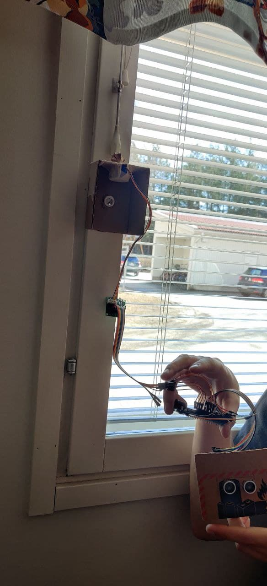
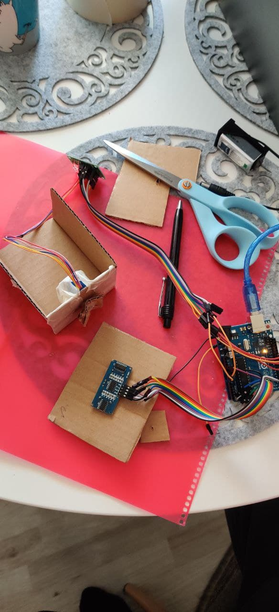
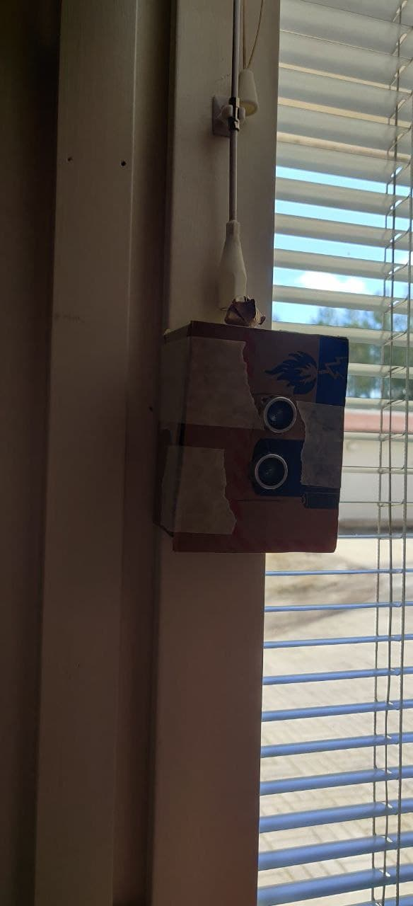

# digifab-project

Course work for principles of digital fabrication 2021 course.

##  Project topic

Project idea is to create automatic blind opener which opens or closes blinds when user moves hand through distance sensor

## Parts required
- Arduino UNO
- Ultrasonic distance sensor
- Stepper motor
- Wires

## Wiring

 | 
|

## Demonstration

Click image to watch

